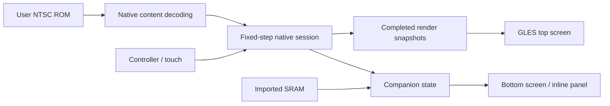

# Native AYN Thor port

This is a running development slice, not a playable whole-game port: the Landing Site to Bomb Torizo route plays natively (Milestone 2), the rest of the game does not. The C++20 core decodes original ROM content and translates Samus, doors, items, saves and the route's enemies; Kotlin hosts it on Android 13+ ARM64 with GLES 3 rendering and a second-screen companion. No 65816 CPU interpreter or emulator gameplay core is used.

## Implemented

| Area | Current behavior |
| --- | --- |
| ROM import | Android document picker, optional copier-header removal, exact NTSC SHA-256 validation, atomic private storage |
| Content | Bounded LoROM reads, all compression commands, 262 default room states, foreground tiles/palettes, standing/running Samus sprites |
| Room links | Bounded door lists for all 262 rooms, destination graph, explicit development traversal with safe provisional placement |
| Room states | Native condition-chain evaluation for events, bosses, collected items, resource capacity and entering door |
| Combat | Native Power Beam, missiles and bombs with original artwork/speeds/cooldowns, five shots, blue/red/grey caps, shot blocks and Chozo orbs |
| Route content | Pose transitions from `$91` tables, doors/elevator with scroll timing, load stations, Morph Ball/Bombs/Missile pickups, Pit pirates, Bomb Torizo, native new/load/save |
| Movement | Fixed-point position/velocity, original gravity/jump and basic X-speed constants, static blocks, slope geometry, signed BTS extensions |
| Widescreen | Additional room geometry at 16:9, original 224-pixel vertical field, centered original-width camera, original-aspect option |
| Interpolation | NTSC timestamp accumulator, previous/current completed-state interpolation, generation reset on room selection, pause/resume reset |
| Android | Controller/keyboard input, touch movement, refresh-rate request, surface lifecycle, display discovery and reassignment |
| Companion | Explored cells in current room, drag/pinch map, local waypoint, pause, SRAM inventory inspection, settings, development room selection |
| SRAM | Three 0x65C-byte slots in 8 KB SRAM, primary/backup checksum validation, resource summary, unchanged import/export |
| Verification | Native tests, pinned byte-exact reference build, hardware test script, SurfaceFlinger presentation sampler, CI definition |

Static slope shape collision is implemented. Original directional slope alignment, unusual collision exploits and the full Samus movement/pose state machine are still absent. Room selection uses an empty progression context in the development app; SRAM import does not restore gameplay.

## Build and run

Pinned toolchain: Java 21, Gradle 8.14.5, Android Gradle Plugin 8.13.2, Kotlin 2.2.20, SDK platform 35, NDK 27.3.13750724, CMake 3.31.6. Install these SDK packages, configure `ANDROID_HOME` or `android/local.properties`, then:

```powershell
cd android
./gradlew.bat testDebugUnitTest assembleDebug assembleRelease lintDebug assembleDebugAndroidTest
```

On Linux/macOS use `bash gradlew`. The installable development APK is `android/app/build/outputs/apk/debug/app-debug.apk`. The release output is unsigned; no signing key is checked in. This project targets the Thor's ARM64 hardware, not x86 emulators.

```powershell
adb install -r android/app/build/outputs/apk/debug/app-debug.apk
adb shell am start -n org.supermetroid.thor/.MainActivity
```

Use **Import NTSC ROM** on the top screen. Supported unheadered ROM:

```
Size:   3145728 bytes
SHA-1:  da957f0d63d14cb441d215462904c4fa8519c613
SHA256: 12b77c4bc9c1832cee8881244659065ee1d84c70c3d29e6eaf92e6798cc2ca72
CRC32:  D63ED5F8
```

PAL, ROM hacks, other revisions and emulator save states are unsupported. Imported ROMs are stored privately and omitted from backup/transfer. The APK contains code and address metadata; it contains no ROM, ripped artwork, music or saves. Existing legacy repository assets are outside the Android source/build graph.

Controls: D-pad/left stick or WASD to move, B/Space to jump, Y/J to shoot, Select toggles missiles, Start to pause. Down crouches; down again morphs, up unmorphs. Up/down aims vertically while standing; moving with up/down aims diagonally. Existing bindings can change the default controller buttons. The bottom-screen controls provide the same provisional movement inputs. Choose **Companion** on the top screen for an inline helper if no secondary display exists. Under **Settings > Traverse room exit - development tool**, choose a ROM-defined link to load its destination near the entry door. This tool bypasses locks and custom scripts; shooting opens blue caps, while walking through room triggers and original door scrolling are still pending. Elevator and special transitions are rejected. Failed or stale choices preserve the current session. Movement tick and pause state survive successful traversal, with velocity/input cleared and interpolation reset. Settings scroll vertically on the bottom display.

The companion display uses Android `Presentation`; one tracked activity provides fallback when the OS permits it. If both secondary window paths fail, the companion opens inline. Generation tokens invalidate pending launches on suspend/removal/reassignment, and the fallback activity closes when the game stops. **Assign companion display** applies immediately and omits the game display; saved assignments use display name/physical dimensions rather than logical IDs. The companion's view uses its own display context.

Settings also provide persistent **Jump controller button**, **Pause controller button** and **Shoot controller button** assignments. Choosing an already-bound button swaps the conflicting action bindings. D-pad/left stick and WASD/Space retain their movement/jump meanings. Held inputs are tracked per key and device and clear on disconnect/remap/suspension. Joystick dead zones respect device motion ranges, and the D-pad hat takes precedence over an opposing stick.

**Requested render refresh** switches the game's preference between 60 and 120 Hz. The app requests a supported mode at the current physical resolution as well as a Surface frame rate. The companion requests 60 Hz. Android/firmware policy can override either request; diagnostics and presentation captures record actual cadence separately from the preference.

## Reference and tests

The reference submodule is InsaneFirebat/sm_disassembly at `11c906f547edc1b57f5a5923cf977fe7b50a3694`. Initialize it with:

```powershell
git submodule update --init reference/sm-disassembly
python tools/build_reference.py PATH_TO_YOUR_ROM.sfc
```

This validates your ROM, extracts private data, rebuilds the anchored NTSC disassembly, checks byte identity, and regenerates `native/generated/reference_index.hpp`. Private outputs live under ignored `build/` and the reference's ignored `data/*.bin` files. Normal APK builds use the checked-in address index and need no reference asset extraction.

Milestone 1 host-policy tests run with `testDebugUnitTest`. Build the development and instrumentation APKs, import the ROM once, and run this hardware suite from the repository root:

```powershell
python tools/verify_foundation.py --adb "$env:LOCALAPPDATA/Android/Sdk/platform-tools/adb.exe" --serial YOUR_SERIAL --seconds 30
```

This installs the APKs, runs seven device contracts, captures both firmware modes, and restores the original system refresh settings in a `finally` block. It requires an authorized Thor with an already imported ROM and the same debug signing key as the installed APK. A signing-key mismatch fails installation without uninstalling or clearing user data. `--skip-tests` repeats captures only. Raw artifacts remain under ignored `build/m1/`. See [Milestone 1 verification](MILESTONE_1_VERIFICATION.md) for the exact limits.

Route regression (about one second, needs your ROM): `build/core/thor_tests PATH_TO_YOUR_ROM.sfc --route tools/routes/landing_site_to_bomb_torizo.txt` replays recorded controller input from a new game to a defeated Bomb Torizo; `--milestone2` runs the focused station/save/item/enemy checks. On Windows with MSYS2, put `C:/msys64/ucrt64/bin` first on PATH so the matching `libstdc++` loads.

For each implementation increment, use a basic build and focused smoke check; the foundation hardware suite and presentation captures are optional follow-ups. For the first Milestone 2 gameplay increment, after building the native tests, run `build/core/thor_tests PATH_TO_YOUR_ROM.sfc --gameplay` to check beams and blue caps without decoding all rooms.

Portable tests without a ROM:

```text
cmake -S native -B build/core -DCMAKE_BUILD_TYPE=Release
cmake --build build/core
ctest --test-dir build/core --output-on-failure
```

ROM fixtures, running directly on a connected Windows/ADB Thor:

```powershell
./tools/test_native_android.ps1 -Serial YOUR_SERIAL -RomPath PATH_TO_YOUR_ROM.sfc
python tools/measure_frames.py --serial YOUR_SERIAL --seconds 30 --output build/presentation-metrics.json
```

The test script requires the pinned SDK tools. Omit `-RomPath` for ROM-independent checks. Tests with the ROM cover all 262 default rooms, state-selection priority, sprite decoding, decompression bounds, slope shapes/extensions, SRAM recovery, pause/resume, door graph resolution, connected-room development traversal/rejection, and simulation equality under 60/120 Hz display callbacks. They do **not** establish original-game gameplay parity.

## Architecture



`Session` is the authoritative movement state; the renderer never advances it. JNI serializes access to the shared session. Android's main-thread Choreographer advances simulation and requests GL frames. The Milestone 1 cadence comparison retains this backend; AGDK/Swappy is not integrated. Advertised refresh, callback frequency, GL submissions and actual presentation intervals are reported separately, and exact frame-budget compliance is diagnostic rather than a milestone blocker under the current validation policy. The GL thread copies snapshots, then submits rendering without holding the simulation lock. The companion samples at approximately 60 Hz. Display callbacks, device input and lifecycle events operate on the main thread; imports/room decoding use a worker.

The NTSC clock uses 21,477,272 master-clock cycles/second and 357,366 cycles/frame rather than an alternating two-display-frame schedule. Stable interpolation adds about one simulation tick of latency. Teleports/room selections/context resets avoid blending incompatible snapshots. Animation poses and discrete gameplay events are not interpolated.

The widescreen renderer exposes extra world geometry around the original-width camera. Scripts, enemy activation and triggers are not implemented yet, so their original-width activation contract is a requirement for the next gameplay stages, not a tested feature of this build.

## Source mapping

| Native subsystem | Reference |
| --- | --- |
| Decompression | `$80:B119` |
| Samus graphics DMA | `$80:9376..9415`; bank `$92` pose/animation/spritemap tables |
| SRAM slots/checksums | `$81` save/load routines and WRAM `$09A2` resource layout |
| Room content and state conditions | bank `$8F`; `$8F:E5D2..E689` |
| Door graph and provisional traversal | Room header +9 door-list pointer; bank `$83` 12-byte headers; `$82:DE12` reference fields (original transition state machine pending) |
| Basic movement constants | bank `$90` physics/X-speed tables |
| Static slope geometry | `$94:8B2B`, `$94:8E54` |
| Signed collision extensions | `$94:9411`, `$94:9447` |

See [IMPLEMENTATION_STATUS.md](IMPLEMENTATION_STATUS.md) for measured results, the current validation policy and remaining functional scope.
